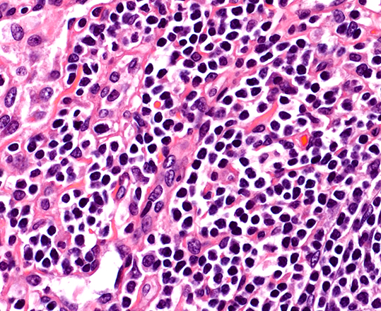
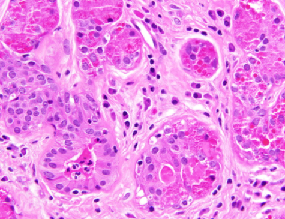
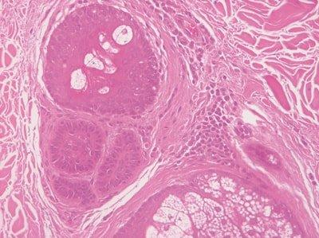
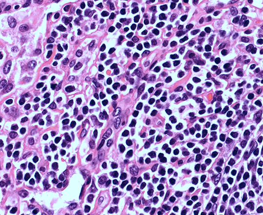
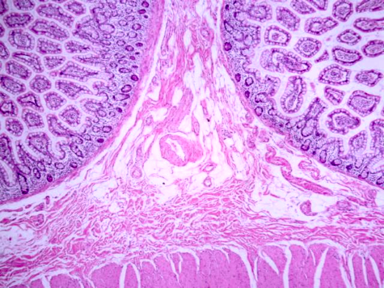
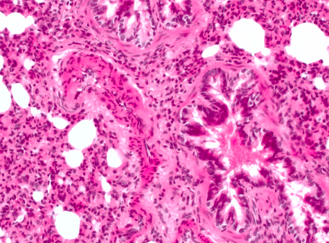
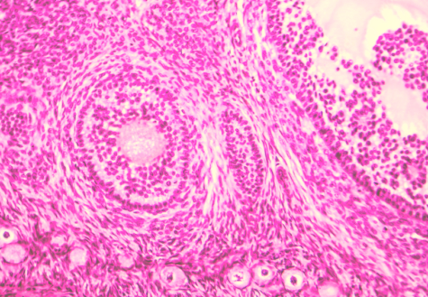
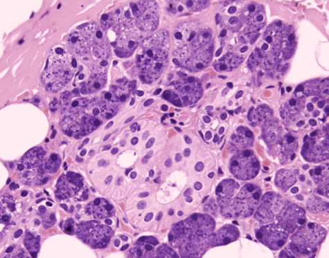
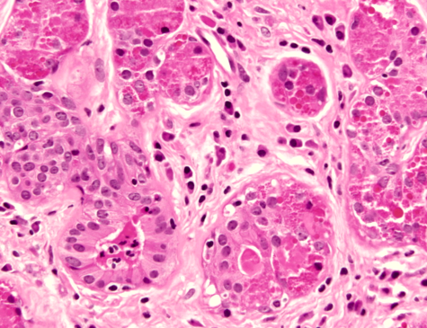
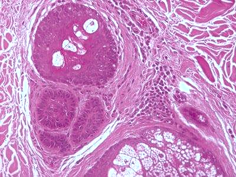

# RandStainNA — Random Stain Normalization and Augmentation

## Overview

**RandStainNA** is a hybrid framework that fuses **stain normalization** and **stain augmentation** to generate more realistic stain variations in histopathology images. It incorporates randomness into stain normalization by automatically selecting a random virtual template from pre-estimated stain style distributions, enriching the stain styles visible to deep neural networks during training while constraining the distortion range to a practicable level.

> Based on the paper: [RandStainNA](https://arxiv.org/abs/2206.12694) | [Original Repository](https://github.com/yiqings/RandStainNA)

---

## RandStainNA Concept


The image above (`RandStina.png`) illustrates the RandStainNA pipeline:

- **Stain Normalization (SN)** transforms all images toward a single fixed template style — reducing variation but potentially losing useful diversity.
- **Stain Augmentation (SA)** applies random color distortions — increasing variation but sometimes producing unrealistic artifacts.
- **RandStainNA** combines both: it normalizes images toward a *randomly sampled* template drawn from a learned distribution of real stain styles (LAB color space statistics), producing augmented images that are both diverse and realistic.

---

## Project Structure

```
├── main.py                          # Main script — runs RandStainNA on images
├── randstainna.py                   # Core RandStainNA class (normalization + augmentation logic)
├── 000-Reinhard_stain_norm_only.py  # Baseline: Reinhard stain normalization only
├── 001_stain_augmentation_only.py   # Baseline: ColorJitter stain augmentation only
├── RandStainNA_Augmentation.ipynb   # Jupyter notebook version (Google Colab compatible)
├── RandStina.png                    # Pipeline diagram
├── data/
│   ├── original/                    # Input histopathology images (1.png – 7.png)
│   └── augmented/                   # Output images after RandStainNA
└── preprocess-statistics/
    ├── datasets_statistics_V1.0.py  # Script to compute LAB statistics from training images
    ├── train/                       # Training images organized by style folders
    └── output/
        └── random_images.yaml       # Pre-computed LAB channel statistics (mean/std)
```

---

## How It Works

### Step 1 — Compute Stain Statistics (one-time)

`preprocess-statistics/datasets_statistics_V1.0.py` scans training images, converts them to **LAB** color space, computes per-channel mean/std, fits normal/laplace distributions, and saves the result to a YAML file:

```yaml
# random_images.yaml (excerpt)
L:
  avg: {mean: 172.338, std: 13.62, distribution: laplace}
  std: {mean: 36.644, std: 11.737, distribution: laplace}
A:
  avg: {mean: 167.216, std: 8.821, distribution: norm}
  ...
color_space: LAB
methods: Reinhard
```

### Step 2 — Run RandStainNA

`main.py` loads the YAML statistics, creates a `RandStainNA` instance, and processes every image in `data/original/`:

1. **Read** an input image (BGR via OpenCV).
2. **Convert** to LAB color space.
3. **Sample** target mean/std from the learned distributions (normal/laplace/uniform).
4. **Normalize** each channel: `output = (pixel - src_mean) * (tar_std / src_std) + tar_mean`
5. **Convert** back to BGR and **save** to `data/augmented/`.

### Input vs Output

| Input (`data/original/`) | Output (`data/augmented/`) |
|---|---|
| Raw histopathology images with varying stain styles | Stain-normalized & augmented images with realistic color variation |

#### Original Images (Input)

| 1.png | 2.png | 3.png | 4.png | 5.png | 6.png | 7.png |
|:---:|:---:|:---:|:---:|:---:|:---:|:---:|
|  |  |  |  |  |  |  |

#### Augmented Images (Output)

| 1.png | 2.png | 3.png | 4.png | 5.png | 6.png | 7.png |
|:---:|:---:|:---:|:---:|:---:|:---:|:---:|
|  |  |  |  |  |  |  |

### Comparison Scripts

| Script | What It Does |
|---|---|
| `000-Reinhard_stain_norm_only.py` | Classic Reinhard normalization using a **fixed** template image (`3.png`) — all outputs look similar |
| `001_stain_augmentation_only.py` | Random `ColorJitter` augmentation — outputs can be unrealistic |
| `main.py` | **RandStainNA** — best of both worlds: realistic + diverse |

---

## Installation

```bash
pip install opencv-python numpy scikit-image pyyaml
# For stain augmentation baseline only:
pip install torch torchvision pillow
# For computing statistics:
pip install fitter
```

---

## Usage

### Run RandStainNA

```bash
python main.py
```

This reads images from `data/original/` and writes augmented images to `data/augmented/`.

### Run Baselines

```bash
python 000-Reinhard_stain_norm_only.py   # Reinhard normalization only
python 001_stain_augmentation_only.py    # ColorJitter augmentation only
```

### Recompute Statistics (optional)

```bash
cd preprocess-statistics
python datasets_statistics_V1.0.py
```

---

> Replace `YOUR_USERNAME` with your actual GitHub username and the repo name with whatever you chose on GitHub.

### If you already have a GitHub repo and want to update it:

```bash
git add .
git commit -m "Update project files"
git push
```

### Update only the README.md:

```bash
git add README.md
git commit -m "Update README.md"
git push
```

---

## References

- Paper: [RandStainNA: Learning Stain-Agnostic Features from Histology Slides by Bridging Stain Augmentation and Normalization](https://arxiv.org/abs/2206.12694)
- Original code: [github.com/yiqings/RandStainNA](https://github.com/yiqings/RandStainNA)
